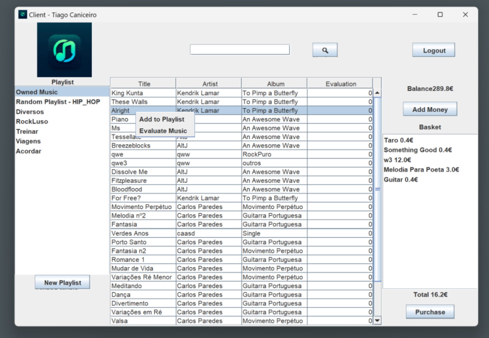

# RockStar Inc.

## Description
RockStar Inc. is a music management system that allows users to explore, create and manage music collections. This system is divided into two main parts: the back-end, which handles the business logic, and the front-end, which offers a graphical interface for user interaction.

## Functionalities
User Management: The system supports different types of users, including customers and music creators.
Authentication: Login and registration functionality with validation.
Music Management: Users can create, edit and manage songs and music collections.
Search: Search functionality to find songs and collections based on specific criteria.
Random Playlist: Generation of playlists based on musical genres and user preferences.
Statistics: View statistics related to songs, sales and user activity.
Technologies Used
Java: Main language for system development.
Swing: Used to create the graphical user interface (GUI).

  

    
    

     

    
    
    
    
    

  
## RockstarIncManager:
 Main class of the frontend.
## GUIManager: 
Manages the various GUI screens and interactions.

## Authors
Tiago Caniceiro,
Pedro Monteiro

Backgroud Image licence for non comercial use: https://pixabay.com/photos/samsung-phone-music-play-earphones-605439/
https://pixabay.com/service/license-summary/